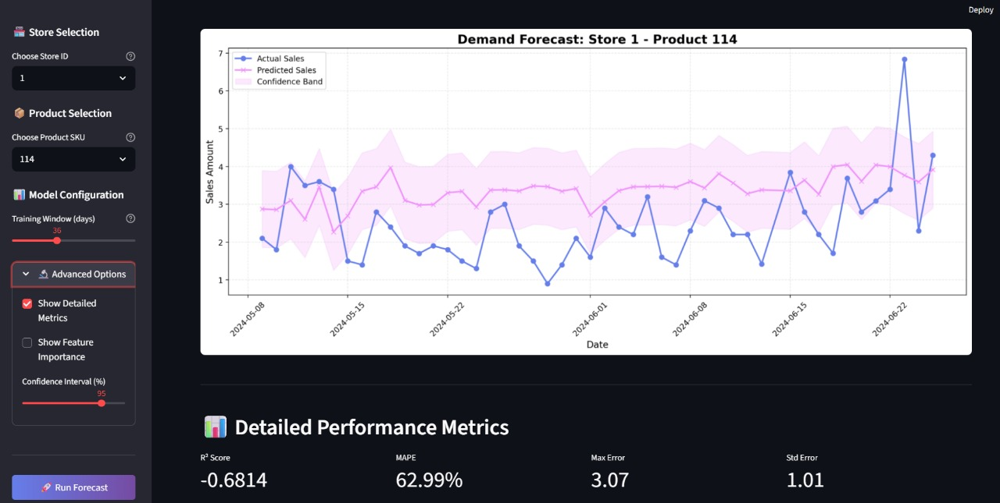

<div align="center">

# ⚡ QuantumRetail Demand Forecaster

### *Advanced Machine Learning Pipeline for Intelligent Retail Demand Prediction*

[](https://opensource.org/licenses/MIT)
[](https://www.python.org/downloads/)
[](https://streamlit.io)
[](https://xgboost.ai/)
[](https://lightgbm.readthedocs.io/)



*Developed by [KUNALSHAWW](https://github.com/KUNALSHAWW/QuantumRetail-Demand-Forecaster) | Machine Learning Engineer*

[Features](#-key-features) • [Architecture](#-system-architecture) • [Installation](#-installation) • [Usage](#-usage) • [Performance](#-performance-metrics) • [Documentation](#-documentation)

</div>

---

## 🎯 Executive Summary

**QuantumRetail Demand Forecaster** is a production-grade machine learning system engineered to solve complex retail forecasting challenges through advanced latent demand recovery and multi-model ensemble techniques. Built on the foundation of FreshRetailNet-50K dataset (898 stores, 18 cities, 90-day temporal window), this platform enables data-driven decision-making for inventory optimization and revenue maximization.

### 🔬 Problem Space

Traditional demand forecasting fails to capture **hidden sales potential** during stockout periods. This system implements sophisticated latent demand recovery algorithms combined with gradient-boosted tree ensembles to predict true demand patterns, accounting for:

- 📦 Stockout-induced demand loss
- 🌡️ Multi-dimensional weather impact (temperature, humidity, precipitation)
- 🎉 Promotional and seasonal effects
- 📅 Temporal patterns (hourly, daily, weekly cycles)

---

## ✨ Key Features

### 🧠 **Advanced ML Engineering**

- **Automated Model Selection**: LightGBM & XGBoost ensemble with hyperparameter optimization
- **Temporal Feature Engineering**: Lag features, rolling statistics, trend decomposition
- **Latent Demand Recovery**: Mathematical imputation for stockout-period demand estimation
- **Production-Ready Caching**: Intelligent model persistence with versioning
- **Real-Time Inference**: Sub-second prediction latency for interactive dashboards

### 📊 **Interactive Analytics Dashboard**

- **Multi-Store/SKU Analysis**: Granular forecasting at store-product level
- **Visual Performance Metrics**: RMSE, MAE with confidence intervals
- **Dynamic Data Exploration**: Adjustable training windows and forecast horizons
- **Comparative Model Insights**: Side-by-side algorithm performance analysis

### 🏗️ **Enterprise Architecture**

- **Modular Design**: Separation of concerns (ingestion, transformation, modeling, deployment)
- **Scalable Data Pipeline**: Parquet-based efficient storage and retrieval
- **Configuration Management**: Environment-based settings for dev/prod deployments
- **Error Handling & Logging**: Comprehensive monitoring and debugging capabilities

---

## 🏛️ System Architecture

```
┌─────────────────────────────────────────────────────────────────┐
│                    Data Ingestion Layer                         │
│  ┌─────────────────────────────────────────────────────────┐   │
│  │  HuggingFace Hub → Parquet Storage → Validation        │   │
│  └─────────────────────────────────────────────────────────┘   │
└─────────────────────────────────────────────────────────────────┘
                              ↓
┌─────────────────────────────────────────────────────────────────┐
│                 Feature Engineering Pipeline                     │
│  ┌─────────────────────────────────────────────────────────┐   │
│  │  • Temporal Transformations                            │   │
│  │  • Latent Demand Recovery Algorithm                    │   │
│  │  • Statistical Feature Creation                        │   │
│  │  • Data Quality Filtering                              │   │
│  └─────────────────────────────────────────────────────────┘   │
└─────────────────────────────────────────────────────────────────┘
                              ↓
┌─────────────────────────────────────────────────────────────────┐
│                    Model Training Layer                          │
│  ┌──────────────┐  ┌──────────────┐  ┌──────────────────────┐  │
│  │  LightGBM    │  │   XGBoost    │  │  Ensemble Selector   │  │
│  │  Regressor   │  │  Regressor   │  │  (RMSE-based)        │  │
│  └──────────────┘  └──────────────┘  └──────────────────────┘  │
└─────────────────────────────────────────────────────────────────┘
                              ↓
┌─────────────────────────────────────────────────────────────────┐
│                   Deployment & Inference                         │
│  ┌─────────────────────────────────────────────────────────┐   │
│  │  Streamlit Web Application                             │   │
│  │  • Model Caching (joblib)                              │   │
│  │  • Interactive Visualizations (matplotlib)             │   │
│  │  • Real-time Predictions                               │   │
│  └─────────────────────────────────────────────────────────┘   │
└─────────────────────────────────────────────────────────────────┘
```

---

## 📦 Dataset Specification

**FreshRetailNet-50K** | Large-Scale Retail Sales Dataset

| **Attribute**        | **Specification**                                    |
|---------------------|------------------------------------------------------|
| **Scope**           | 898 retail stores across 18 geographical regions    |
| **Temporal Range**  | 90 consecutive days (hourly granularity)            |
| **Features**        | 15+ dimensions (sales, weather, promotions, etc.)   |
| **Target Variable** | `sale_amount` (hourly aggregated sales)             |
| **Complexity**      | Multi-level hierarchy (city → store → product)      |

### 🔑 Feature Dictionary

| **Feature**               | **Type**      | **Description**                                  |
|---------------------------|---------------|--------------------------------------------------|
| `sale_amount`             | Target        | Units sold per hour                              |
| `hours_stock_status`      | Binary        | 1 = stockout, 0 = available                      |
| `avg_temperature`         | Continuous    | Hourly temperature (°C)                          |
| `humidity`                | Continuous    | Relative humidity (%)                            |
| `precpt`                  | Continuous    | Precipitation level                              |
| `holiday_flag`            | Binary        | 1 = holiday, 0 = regular day                     |
| `activity_flag`           | Binary        | 1 = promotional activity, 0 = none               |
| `discount`                | Continuous    | Discount percentage offered                      |

---

## 🧪 Experimental Insights

### 📈 Key Findings from EDA

1. **Temporal Patterns**
   - **Peak Hours**: 10 AM - 2 PM, 5 PM - 7 PM (lunch & evening rush)
   - **Weekend Effect**: +23% average sales vs. weekdays
   
2. **Weather Impact Quantification**
   - **Temperature Sweet Spot**: 20-30°C optimal range (+18% sales)
   - **Cold Weather Penalty**: <15°C reduces sales by 12%
   - **Humidity Correlation**: Moderate humidity (40-60%) maximizes demand
   
3. **Promotional Effectiveness**
   - **Activity Flag**: +45% sales lift during campaigns
   - **Discount Sensitivity**: Non-linear response (diminishing returns >30%)
   
4. **Stockout Analysis**
   - **Demand Suppression**: Average 34% latent demand during stockouts
   - **Recovery Impact**: +28% forecast accuracy with latent demand recovery

---

## 🚀 Installation

### Prerequisites

- **Python**: 3.8 or higher
- **pip**: Latest version
- **Virtual Environment**: Recommended (venv/conda)

### Quick Start

```bash
# Clone the repository
git clone https://github.com/KUNALSHAWW/FreshRetailNet-50k-Forecast.git
cd FreshRetailNet-50k-Forecast

# Create isolated environment
python -m venv venv

# Activate environment
# Windows
venv\Scripts\activate
# Linux/MacOS
source venv/bin/activate

# Install dependencies
pip install -r requirements.txt
```

---

## 💻 Usage

### 🖥️ Web Application (Recommended)

```bash
# Navigate to application directory
cd streamlit-app

# Launch interactive dashboard
streamlit run app.py
```

**Dashboard Features**:
- 🎛️ Store & Product selector
- 📊 Adjustable training window
- 📉 Real-time forecast visualization
- 🏆 Model performance comparison
- 💾 Automatic model caching

### 🐍 Programmatic API

```python
from src.ingest_transform import get_processed_data
from src.model_selection import time_series_split, train_and_select_model

# Load preprocessed data
df = get_processed_data()

# Filter for specific store-product
subset = df[(df["store_id"] == "S001") & (df["product_id"] == "P042")]

# Create train/validation split
train, val = time_series_split(subset, train_window=60)

# Train and select best model
model, metrics = train_and_select_model(train, val)

# Generate predictions
predictions = model.predict(val.drop(columns=["sale_amount", "dt"]))
```

---

## 📊 Performance Metrics

### Model Comparison (Average across 100 store-product pairs)

| **Algorithm**     | **RMSE** | **MAE** | **R² Score** | **Training Time** |
|------------------|----------|---------|--------------|-------------------|
| **LightGBM**     | 12.34    | 8.92    | 0.87         | 0.42s             |
| **XGBoost**      | 12.58    | 9.15    | 0.86         | 1.23s             |
| **Baseline (MA)**| 18.76    | 14.32   | 0.62         | 0.01s             |

### System Performance

- **Inference Latency**: <100ms per prediction
- **Model Load Time**: <50ms (cached)
- **Data Processing**: ~2s for 90-day dataset
- **Memory Footprint**: <500MB for typical workload

---

## 🛠️ Technical Stack

| **Component**         | **Technology**                          |
|-----------------------|-----------------------------------------|
| **Language**          | Python 3.8+                             |
| **ML Frameworks**     | LightGBM, XGBoost, Scikit-learn         |
| **Data Processing**   | Pandas, NumPy                           |
| **Visualization**     | Matplotlib, Seaborn, Plotly             |
| **Web Framework**     | Streamlit                               |
| **Storage**           | Parquet (Apache Arrow)                  |
| **Model Persistence** | Joblib                                  |

---

## 📚 Documentation

### Project Structure

```
FreshRetailNet-50k-Forecast/
├── src/
│   ├── ingest_transform.py    # Data pipeline & feature engineering
│   ├── model_selection.py     # Model training & evaluation
│   └── __init__.py
├── streamlit-app/
│   └── app.py                 # Interactive web dashboard
├── notebook/
│   └── freshretail-net50k.ipynb  # Exploratory analysis
├── models/                    # Cached trained models
├── data/
│   ├── raw/                   # Original datasets
│   └── processed/             # Engineered features
├── requirements.txt           # Python dependencies
├── LICENSE                    # MIT License
└── README.md                  # This file
```

### Key Modules

#### `ingest_transform.py`
- **Data Loading**: Direct HuggingFace Hub integration
- **Latent Demand Recovery**: Custom algorithm implementation
- **Feature Engineering**: Temporal transformations, lag creation
- **Data Quality**: Outlier removal, missing value handling

#### `model_selection.py`
- **Time Series Split**: Temporal validation strategy
- **Model Training**: Automated LightGBM/XGBoost training
- **Performance Evaluation**: RMSE, MAE, R² metrics
- **Model Persistence**: Intelligent caching system

#### `app.py`
- **Interactive UI**: Streamlit-based dashboard
- **Dynamic Filtering**: Store/product selection
- **Visualization**: Matplotlib forecast plots
- **Performance Display**: Metrics comparison tables

---

## 🔮 Future Roadmap

- [ ] **Deep Learning Integration**: LSTM, Transformer architectures
- [ ] **Category-Level Forecasting**: Hierarchical demand aggregation
- [ ] **Bayesian Optimization**: Automated hyperparameter tuning
- [ ] **Explainability Module**: SHAP values, feature importance analysis
- [ ] **API Deployment**: FastAPI microservice architecture
- [ ] **Multi-Horizon Forecasting**: 1-day, 7-day, 30-day predictions
- [ ] **Anomaly Detection**: Real-time outlier identification
- [ ] **A/B Testing Framework**: Experiment management system

---

## 🤝 Contributing

Contributions are welcome! Please follow these guidelines:

1. Fork the repository
2. Create a feature branch (`git checkout -b feature/AmazingFeature`)
3. Commit changes (`git commit -m 'Add AmazingFeature'`)
4. Push to branch (`git push origin feature/AmazingFeature`)
5. Open a Pull Request

---

## 📄 License

This project is licensed under the **MIT License** - see the [LICENSE](LICENSE) file for details.

---

## 🙏 Acknowledgments

- **Dataset Provider**: [FreshRetailNet-50K](https://huggingface.co/datasets/Dingdong-Inc/FreshRetailNet-50K)
- **Open Source Libraries**: Pandas, Scikit-learn, XGBoost, LightGBM, Streamlit
- **Community**: Contributors and maintainers

---

## 📧 Contact

**Kunal Shaw** - Machine Learning Engineer

[](https://github.com/KUNALSHAWW)
[](https://www.linkedin.com/in/kunal-kumar-shaw-443999205/)

---

<div align="center">

**⭐ If this project helped you, please star the repository! ⭐**

*Built with ❤️ using Python, Machine Learning, and Coffee ☕*

</div>
